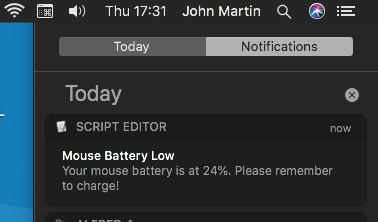

# magic-battery-checker

## Overview 
Check your Magic Keyboard / Mouse battery levels from macOS command line, and trigger notifications on a schedule if battery levels are low.

## Background 
Ever notice that macOS seems to warn you that your Magic Mouse or Magic Keyboard battery is low, about 2 minutes before it runs out?

This can be really inconvenient! Especially if you're on an iMac you don't have a separate keyboard or mouse to fall back on.

So, `magic-battery-checker` aims to help avoid unplanned situations like this: 


  
Combining a command line tool with a piece of AppleScript that runs on a LaunchAgent schedule, we can check the battery level and give an earlier warning that the battery is low, at a time that's a bit more convenient! 

I have mine set up to check the battery level at the end of the day. If the battery is low, I get a reminder like this: 



  

## Notes
This repo includes two utilities:

1. A command line tool `btstat` that reports the battery level of a Magic Mouse and/or Magic Keyboard currently connected to your Mac.
2. A LaunchAgent service that can periodically check the battery level and trigger a notification if the battery is low.

Using these tools, it's possible to trigger a battery check and a battery warning if necessary, at a time that we choose.


## Installation

### Set up `btstat`
1. Copy `btstat` to a suitable location on your Mac. 
    * I have mine in `~/Library/Scripts`, but you can put it wherever you like.
2. Check that `btstat` works correctly by running it from the command line. It should output your keyboard and mouse battery levels (assuming you have both connected):
    ```
    $ btstat
    "MagicMouse2",97
    "MagicKeyboard",70
    ```
**Note: if your devices are named differently to those above, or if you only have one device, you may need to update these in MouseAndKeyboardBatteryChecks.scpt**

### Set up Apple Script
`MouseAndKeyboardBatteryChecks` is an AppleScript that uses `btstat` to fetch the battery levels and triggers macOS push notifications if either of them fall beneath a specified threshold.

1. Open `Service/MouseAndKeyboardBatteryChecks.scpt` using Script Editor, and update the following:
    * `btStatLocation` should match wherever you installed the `btstat` script
    * `warningThreshold` determines when a 'battery low' notification should be triggered. e.g. '30' means a notification will fire if the keyboard or mouse battery falls below 30%. 
    * Edit the device checks as necessary - the default assumes you have a Magic Mouse reported in `btstat` as `MagicMouse2` and a Magic Keyboard reported in `btstat` as `MagicKeyboard`. If you don't need both checks you can remove as necessary. Similarly, if the device names are different, you should update them to match your devices.
2. Move `Service/MouseAndKeyboardBatteryChecks.scpt` to a suitable location on your Mac. 
    * Again I have mine in `~/Library/Scripts` but you can put it wherever you like.

### Set up Service
This sets up a LaunchAgent service which will run the Apple Script on a schedule:
1. Open `net.martinsoft.batterychecker.plist` using a text editor. 
    * This defines a service which will run `MouseAndKeyboardBatteryChecks.scpt`at a time that you choose.
2. Update the path to `MouseAndKeyboardBatteryChecks.scpt` on line 12 to match wherever you installed the script in the previous section.
3. Update the `integer` values for `Hour` and `Minute` to set the time you would like the battery levels to be checked. (It defaults to 5:30pm).
4. Move `net.martinsoft.batterychecker.plist` into `~/Library/LaunchAgents`
5. To start the service for the first time either:
    * 'launchctl load ~/Library/LaunchAgents/net.martinsoft.batterychecker.plist`
    * OR log out and log in again. 

(The service will start automatically every time you restart your machine).
 
To check that the service is running: 
```
launchctl list | grep batterychecker
```
You should see `net.martinsoft.batterychecker` listed.


That's it!

The next time your keyboard or mouse drops below the threshold you set, you should get a notification at the time you set.


*Note: The Push Notification will be from "Script Editor" because it is fired from an Apple Script.*
 
## Support

This script is provided as-is, and without support. 

I've been using it on MacOS Catalina (up to and including macOS 10.15.7) without issue.

If you run into difficulties check that the paths are correct:
* Check that `btstat` returns the correct battery levels for your devices (see below) and that the device names match those in `MouseAndKeyboardBatteryChecks.scpt`
* `MouseAndKeyboardBatteryChecks.scpt` should point to wherever you have installed the `btstat` script and should use the device names returned by `btstat`.
* `net.martinsoft.batterychecker.plist` should point to whenever you installed `MouseAndKeyboardBatteryChecks.scpt`
* `net.martinsoft.batterychecker.plist` must be in `~/Library/LaunchAgents`
* You can check that the agent is running with `launchctl list | grep batterychecker`


## Uninstall
* Delete `~/Library/LaunchAgents/net.martinsoft.batterychecker.plist`
* Delete `btstat` and `MouseAndKeyboardBatteryChecks.scpt` from wherever you installed them
* Restart your Mac or use `launchctl` to unload the battery checker service.

## Further info: btstat

`btstat` is a script which uses ioreg to return the current battery percentages for Apple bluetooth devices connected to your Mac.

When run with no arguments, it will list device names and battery percentages: e.g. 
```
$ btstat
"MagicMouse2",97
"MagicKeyboard",70
```

If run with a device name, it will return a single integer indicating the battery percentage for that device:
```
$ btstat MagicMouse2
97
```


## Feedback

If you're using this and finding it useful, I would love to know! 
Tag me in a picture on [Instagram (@martinsoft)](https://instagram.com/martinsoft)! 😃
